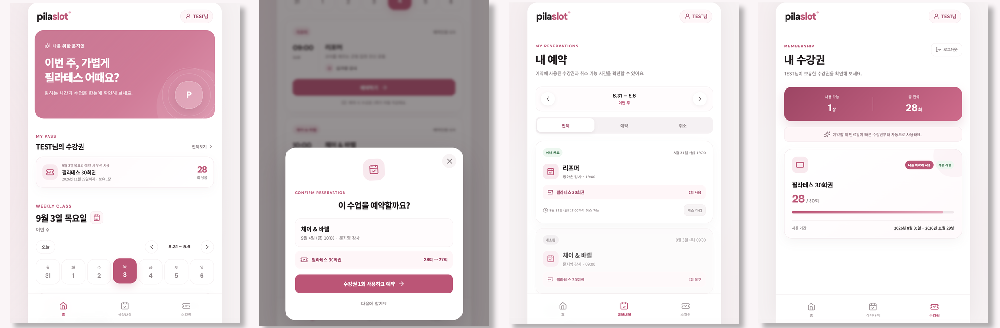
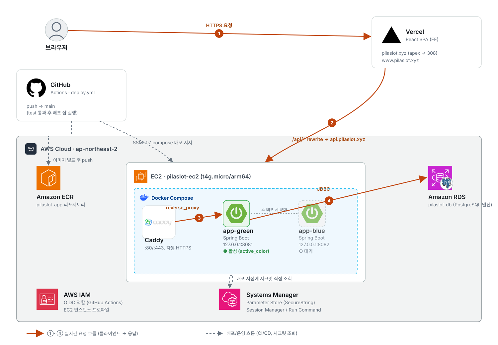

<div align="center">

# 필라슬롯 PilaSlot

### 동시 예약에도 안전한 필라테스 수업 예약 백엔드

[](https://pilaslot.xyz)

[서비스 체험](https://pilaslot.xyz) ·
[Swagger API](https://api.pilaslot.xyz/swagger-ui/index.html) ·
[아키텍처](#architecture) ·
[트러블슈팅](#troubleshooting)

[](https://github.com/kitechoi/pilates-booking-be/actions/workflows/gradle-test.yml)
[](https://github.com/kitechoi/pilates-booking-be/actions/workflows/deploy.yml)


</div>

실제 필라테스 스튜디오의 수업 일정과 수강권 정책을 반영한 예약 서비스입니다. 동시 요청에서도 수업 정원, 회원별 주간 제한, 수강권 잔여 횟수의 정합성을 유지하도록 설계하고 PostgreSQL 동시성 테스트로 검증했습니다.

## 🎬 Service Preview



주간 수업 조회 → 예약 확인 → 내 예약 확인 → 보유 수강권 확인

<a id="troubleshooting"></a>

## 🐛 Troubleshooting

동시 예약 상황에서 발견한 문제와 해결 과정입니다.

### 마지막 한 자리에 동시 요청이 몰릴 때

정원 4명인 수업에 이미 3명이 예약된 상태에서, 서로 다른 회원 5명이 마지막 한 자리를 두고 동시에 예약을 시도하는 테스트를 설계했습니다.

**락 없이 처리한다면?** 두 트랜잭션이 모두 `reserved_count = 3`을 읽고 각각 4로 갱신하면, 실제 예약 행은 5개인데 `reserved_count`는 4로 남는 Lost Update가 발생합니다.

```text
Transaction A: reserved_count 3 조회 ───────────────── 4 저장
Transaction B: reserved_count 3 조회 ───────────────── 4 저장

실제 RESERVED 예약 행: 5
reserved_count 컬럼:   4   ← 불일치
```

**해결**: 회원 → 수업 → 수강권 순서로 비관적 락(Pessimistic Lock)을 획득해, 정원 검증과 예약 생성, 수강권 차감, 변경 이력 기록이 하나의 트랜잭션 안에서 순서대로 처리되도록 했습니다.

```
Member Lock (주간 제한 검증)
    ↓
ClassSession Lock (정원 · reserved_count)
    ↓
MemberPass Lock (잔여 횟수 차감 · 환불)
    ↓
예약 · 이력 저장
```

> [!IMPORTANT]
> **JPA Lock Insight** — 취소 처리에서 예약을 먼저 조회하면 연관된 `ClassSession`이 영속성 컨텍스트에 적재됩니다. 이후 비관적 락 쿼리를 실행해도 같은 엔티티 인스턴스가 재사용될 수 있어, DB의 최신 상태로 자동 갱신된다고 가정할 수 없습니다.
>
> 이를 피하기 위해 수업 ID만 projection으로 먼저 조회한 뒤 `ClassSession`을 잠그고, 그 다음 예약을 조회하도록 순서를 변경했습니다.

### PostgreSQL 동시성 테스트 결과

| 경쟁 조건 | 동시 요청 | 검증 결과 |
|---|---:|---|
| 마지막 수업 1자리 | 5건 | 1건 성공, 4건 `CLASS_SESSION_FULL` |
| 주간 예약 13건 상태에서 추가 예약 | 2건 | 경합 요청 중 1건 성공 · 1건 거절, 주간 예약 총 14건 |
| 잔여 1회 수강권으로 서로 다른 수업 예약 | 2건 | 1건 성공, 1건 `NO_USABLE_MEMBER_PASS`, 잔여 횟수 정확히 0 |
| 동일 예약 동시 취소 | 5건 | 1건 성공, 4건 `RESERVATION_ALREADY_CANCELLED` |
| 서로 다른 예약 5건 동시 취소 | 5건 | 전부 성공, `reserved_count` 정확히 5 감소 |

검증 코드:
[`ReservationConcurrencyTest`](src/test/java/com/pilaslot/reservation/service/ReservationConcurrencyTest.java) ·
[`CancelConcurrencyTest`](src/test/java/com/pilaslot/reservation/service/CancelConcurrencyTest.java) ·
[`WeeklyLimitConcurrencyTest`](src/test/java/com/pilaslot/reservation/service/WeeklyLimitConcurrencyTest.java) ·
[`MemberPassReservationConcurrencyTest`](src/test/java/com/pilaslot/reservation/service/MemberPassReservationConcurrencyTest.java)

<a id="architecture"></a>

## 🏗️ Architecture



1. GitHub Actions가 테스트를 통과한 이미지를 ECR에 게시합니다.
2. AWS Systems Manager(SSM)로 EC2에 새 Blue/Green 컨테이너를 기동합니다.
3. 내부·외부 헬스체크를 통과한 경우에만 Caddy의 트래픽 대상을 전환하고, 실패 시 이전 버전으로 롤백합니다.

<details>
<summary>Blue-Green 배포 및 롤백 과정 보기</summary>

- 새 색상 컨테이너 기동 → 내부 헬스체크
- Caddy 설정을 reload하여 새 컨테이너로 트래픽 전환
- 실제 도메인(`https://api.pilaslot.xyz`) 헬스체크
- 실패 시 이전 Caddy 설정으로 롤백 후 재검증
- 성공 확인 후에만 이전 컨테이너 graceful shutdown

</details>

## ✨ Core Features

| 수업 | 예약 | 수강권 | 인증 |
|---|---|---|---|
| 주간 일정 · 상세 조회 | 예약 · 취소 및 정책 검증 | FEFO(만료 임박 순) 자동 선택 | JWT 로그인 |
| 클래스 유형별 정원 관리 | 중복 · 주간 제한 검증 | 차감 · 환불 이력 관리 | BCrypt 비밀번호 저장 |

<details>
<summary>1차 구현 범위</summary>

회원가입, 관리자 기능은 1차 구현 범위에서 제외했습니다. 실제 스튜디오처럼 관리자가 회원과 수강권을 직접 등록하는 운영 모델을 전제로 합니다.

</details>

## 📋 Domain Rules

- **수업 정원**: 리포머 · 체어바렐 · 랜덤 4명, 애니멀플로우 8명
- **예약 오픈**: 수업 주차 전주 금요일 13시 (운영 데이터 기준)
- **예약 마감**: 수업 시작 2시간 전
- **취소 마감**: 수업 시작 8시간 전
- **주간 제한**: 한 주(월~일)에 예약 14회, 취소 7회까지
- **수강권 사용 순서(FEFO)**: 유효한 수강권 중 만료일이 가장 이른 것부터 차감
- **차감 · 환불 이력**: 예약/취소마다 `MemberPassHistory`에 append-only로 기록

## 🛠️ Technology

| 구분 | 기술 |
|---|---|
| Language | Java 17 |
| Framework | Spring Boot 3.5.16 |
| Security | Spring Security, JWT (jjwt) |
| Persistence | Spring Data JPA, PostgreSQL, Flyway |
| API Docs | springdoc-openapi |
| Test | JUnit 5, Testcontainers |
| Infrastructure | EC2, RDS, ECR, AWS Systems Manager(SSM) |
| Deployment | GitHub Actions, Docker Compose, Caddy |

## 🧪 Testing

- **도메인 규칙**: 정원, 예약/취소 마감, 주간 제한, 수강권 유효기간 단위 테스트
- **인증 · 인가**: JWT 기반 접근 제어 테스트
- **PostgreSQL 통합 테스트**: Testcontainers로 실제 PostgreSQL에 대해 검증
- **DB 정합성**: Flyway로 정의한 CHECK 제약, append-only 트리거(`trg_member_pass_history_append_only`), 수강권 잔여 횟수 검증 트리거(`trg_member_pass_balance`) 테스트
- **트랜잭션 롤백**: 예외 발생 시 부분 반영되지 않는지 확인
- **동시성 회귀 테스트**: [Troubleshooting](#troubleshooting) 참고

## 🎯 Try It

- 🔗 [PilaSlot 실행하기](https://pilaslot.xyz)
- 📑 [Swagger API 확인하기](https://api.pilaslot.xyz/swagger-ui/index.html)

<details>
<summary>데모 계정 보기</summary>

| 아이디 | 비밀번호 |
|---|---|
| `1234` | `1234` |

> [!NOTE]
> 30회 수강권을 보유한 계정이며, 다른 방문자와 예약 · 잔여 횟수를 공유합니다.

</details>

### 주요 엔드포인트

| Method | Endpoint | 설명 |
|---|---|---|
| POST | `/api/v1/auth/login` | 로그인 |
| GET | `/api/v1/class-sessions` | 클래스 세션 목록 조회 |
| GET | `/api/v1/member-passes` | 보유 수강권 조회 |
| POST | `/api/v1/reservations` | 예약 생성 |
| DELETE | `/api/v1/reservations/{id}` | 예약 취소 |

전체 명세는 Swagger UI를 참고하세요.

## 🚀 Getting Started

**요구 사항**: 직접 실행은 Java 17 + Docker, 전체 컨테이너 실행은 Docker만 있으면 됩니다. 테스트는 Docker가 필요합니다(Testcontainers가 PostgreSQL을 실행).

```bash
git clone https://github.com/kitechoi/pilates-booking-be.git
cd pilates-booking-be
docker compose up -d --wait postgres
./gradlew bootRun
```

`local` 프로필이 기본값이라 별도 환경변수 없이 위 명령만으로 실행됩니다. `--wait`를 지원하지 않는 환경에서는 PostgreSQL healthcheck가 `healthy`가 된 후 애플리케이션을 실행하세요. Swagger UI: `http://localhost:8081/swagger-ui/index.html`

```bash
# 전체 컨테이너로 실행
docker compose up --build

# 테스트 실행 (Testcontainers)
./gradlew test
```

## ⚙️ Operations

- 운영 데이터의 영속성 · 자동 백업 · 애플리케이션과의 장애 격리를 위해 PostgreSQL은 RDS에서 운영합니다.
- 스키마는 Flyway 마이그레이션으로 관리합니다.
- 운영 초기 데이터(강사, 클래스 세션 등)는 [검토된 bootstrap SQL](docs/operations/production-bootstrap-template.md)로 수동 입력합니다. 애플리케이션 시작 시 자동으로 삽입하지 않습니다.

> [!NOTE]
> 민감정보(DB 비밀번호, JWT 시크릿)는 AWS SSM Parameter Store에 저장하고 배포 시점에 EC2가 직접 조회합니다. GitHub Secrets나 커맨드 로그에는 노출되지 않습니다.

## 📬 Contact

- GitHub: [@kitechoi](https://github.com/kitechoi)
- Email: chevel0212@gmail.com
